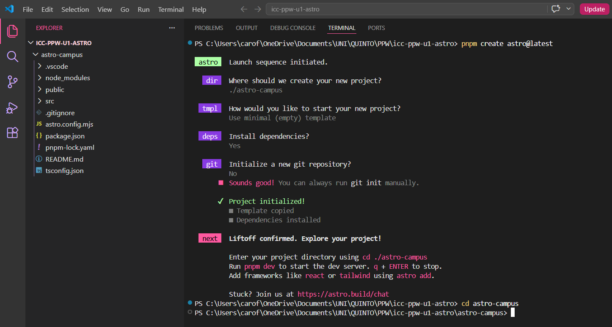
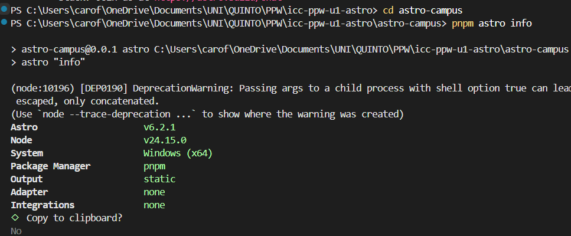
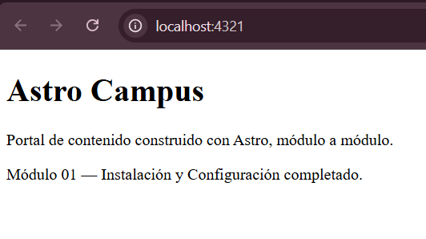
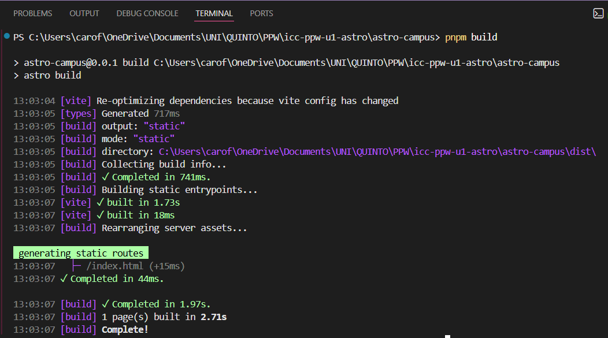
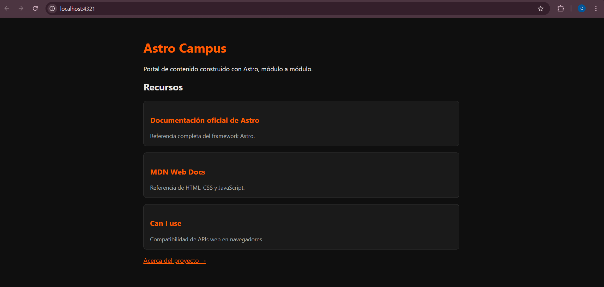
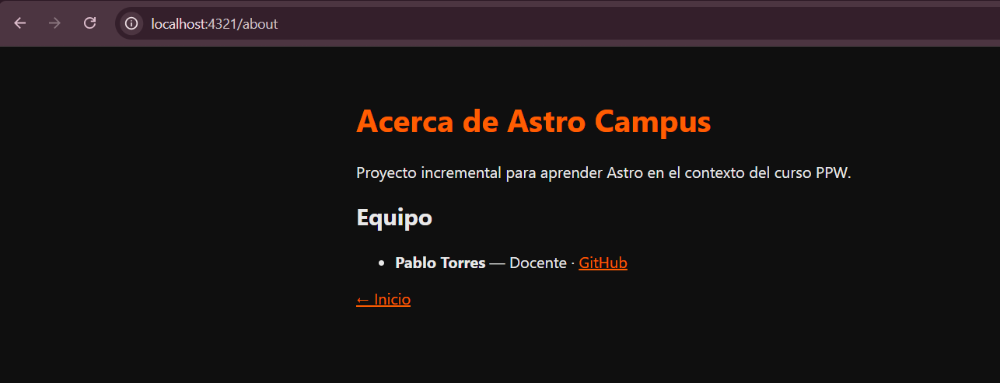
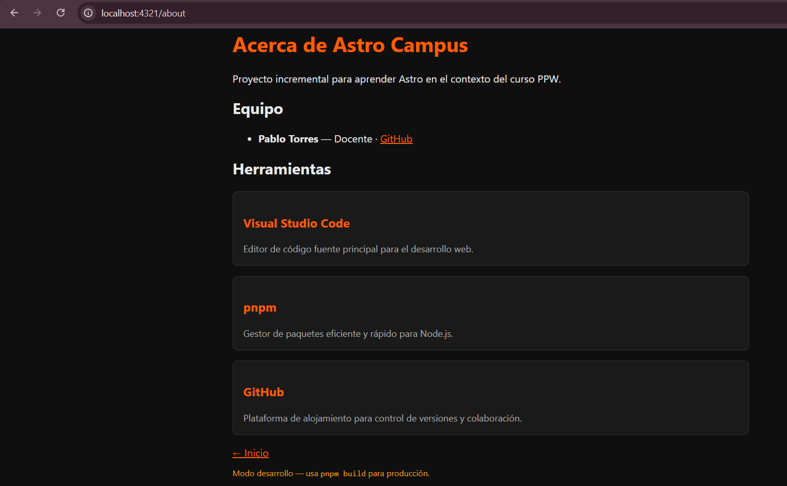

# 01. Instalación y Configuración de Astro

*Carolina Fortmann*

### 1.- Descripción de la práctica:

Este proyecto utiliza **Astro 5.x** como framework principal, aprovechando su capacidad para generar sitios estáticos y optimizados. 
Es importante verificar que la configuracion de *Node.js* y *pnpm* estén correctas:

*   Verificar la versión de *Node.js* con: ```node --version```
*   Verificar la versión de *pnpm* con: ```pnpm --version```

#### ¿Qué se realizó?
*   Se inicializa un proyecto Astro con la plantilla mínima.
*   Se configura la salida estática y la identidad del sitio.
*   Se crea la primera página de inicio funcional utilizando componentes de Astro.


### 2.- Capturas:

#### 1. Creación del Proyecto:


**Descripción:** Se muestra el proceso de configuración inicial con el CLI de Astro, donde se seleccionó la plantilla minimalista y la configuración de TypeScript.


#### 2. Información del entorno:


**Descripción:** Se usa el comando `pnpm astro info` para validar que el proyecto está configurado con salida estática y reconociendo el gestor de paquetes pnpm.


#### 3. Home page funcionando en ```localhost:4321```:


**Descripción:** Vista del navegador en ```http://localhost:4321```. Se confirma que los componentes de Astro están renderizando correctamente el título y la descripción de la página.


#### 4. Build de producción:


**Descripción:** Resultado final tras ejecutar ```pnpm build```, mostrando la generación exitosa de los archivos HTML y los recursos listos para producción.

---

# 02. Fundamentos de Astro

### 1.- Descripción de la práctica:

Esta segunda práctia de Astro se enfocó en la creación de componentes reutilizables, el uso de *props* tipados con TypeScript y el sistema de enrutamiento basado en archivos.

#### ¿Qué se realizó?
*   *Creación de Componentes:* Se desarrolló el componente ```RecursoCard.astro``` para estandarizar la visualización de enlaces y recursos externos.

*   *Props y Tipado:* Se implementó una interfaz de TypeScript para asegurar que cada tarjeta reciba los datos correctos.

*   *Enrutamiento Automático:* Se añadió la página ```about.astro```, validando cómo Astro genera rutas nuevas automáticamente en el directorio ```src/pages/```.

*   *Lógica de Renderizado:* Se aplicó renderizado condicional para mostrar diferentes mensajes según el entorno y para manejar listas de datos.


### 2.- Capturas:

#### 1. Home page con componentes Card:


**Descripción:** Vista de la página principal donde se observa el uso de ```RecursoCard``` para listar los recursos oficiales.


#### 2. Página "Acerca de" y Renderizado Condicional:


**Descripción:** Se muestra la ruta ```/about``` funcionando correctamente. En la parte inferior se observa el mensaje de "Modo desarrollo", validando la lógica de renderizado basada en variables de entorno.


#### 3. Sección de Herramientas de ```about.astro```:


**Descripción:** Captura de la sección de herramientas implementada en la página de información, utilizando nuevamente el componente ```RecursoCard``` y lógica de mapeo de arreglos en el *frontmatter*.
